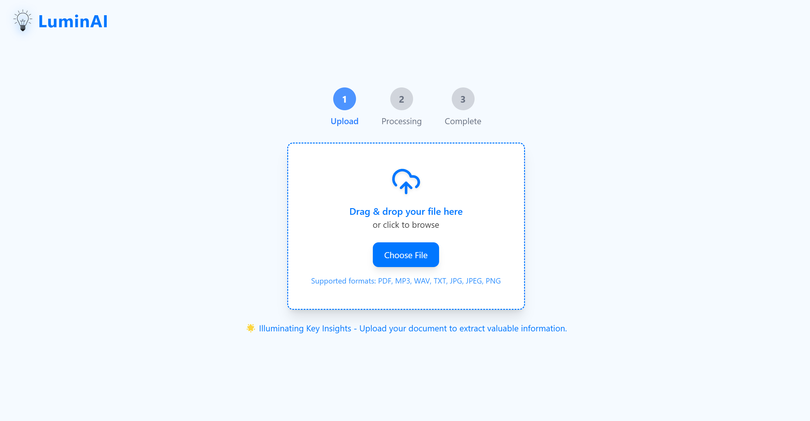
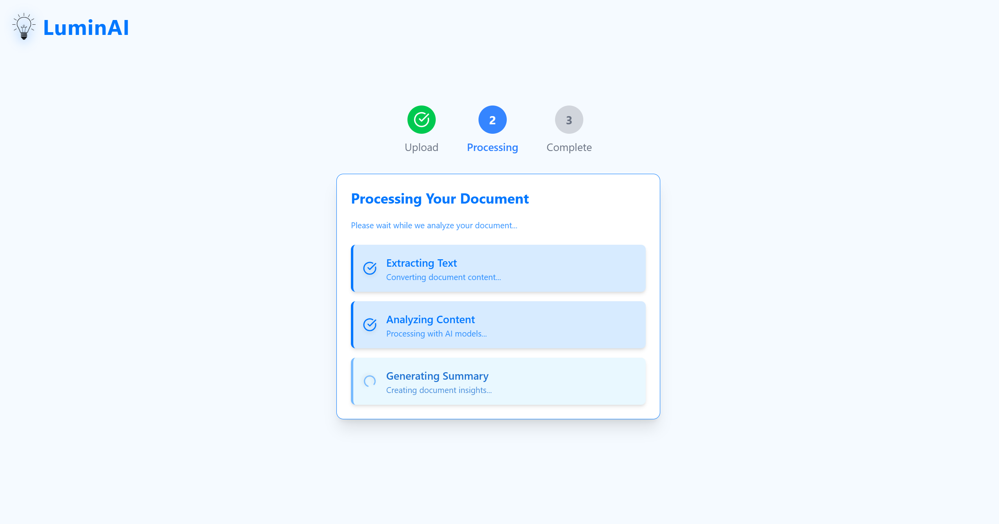
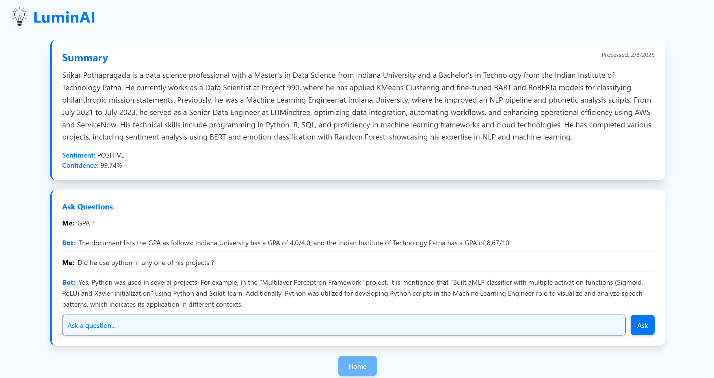

# LuminAI - Illuminating Key Insights

LuminAI is an intelligent document processing platform that extracts, analyzes, and provides insights from various document formats using AI. The platform supports multiple file types and offers features like text extraction, summarization, sentiment analysis, and interactive document querying.

---

## 📸 Screenshots

### Upload Page


### Processing Page


### Summary Page


---

## 🚀 Features

### 🔄 Multi-Format Support
LuminAI processes various file types, including:
- **Images**: JPG, JPEG, PNG
- **Documents**: PDF, TXT
- **Audio Files**: MP3, WAV, M4A

### 🧠 AI-Powered Analysis
- ✅ **Text Extraction**: Extract text from images and PDFs using OCR
- 🎙 **Audio Transcription**: Convert audio to text using Whisper
- 📄 **Document Summarization**: Generate concise summaries of large texts
- 😊 **Sentiment Analysis**: Detect emotions and sentiments in documents
- ❓ **Interactive Q&A**: Query documents with AI-powered responses

### ⏳ Real-time Processing
- Live processing status updates
- Streaming responses for faster interactions

---

## 🛠 Tech Stack

### Frontend
- ⚛ **React (Vite) for fast development**
- 🎨 **TailwindCSS** for styling
- 🛣 **React Router** for navigation
- 🔗 **Axios** for API communication

### Backend
- 🚀 **FastAPI** for backend services
- 🤖 **OpenAI GPT-4** for text analysis
- 🎙 **Whisper** for audio transcription
- 🔍 **PyTesseract** for OCR
- 📊 **Hugging Face Transformers** for sentiment analysis

---

## ⚙ Setup Instructions

### 🖥 Backend Setup

1. Navigate to the **Backend** directory:
   ```bash
   cd Backend
   ```
2. Create a virtual environment (recommended):
   ```bash
   python -m venv venv
   source venv/bin/activate   # On macOS/Linux
   venv\Scripts\activate      # On Windows
   ```
3. Install dependencies:
   ```bash
   pip install -r requirements.txt
   ```
4. Create a `.env` file with your OpenAI API key:
   ```bash
   OPENAI_API_KEY=your-api-key-here
   ```
5. Start the server:
   ```bash
   uvicorn main:app --reload
   ```
   The backend will be available at `http://127.0.0.1:8000`

### 💻 Frontend Setup

1. Navigate to the **Frontend** directory:
   ```bash
   cd Frontend
   ```
2. Install dependencies:
   ```bash
   npm install
   ```
3. Start the development server:
   ```bash
   npm run dev
   ```
   The frontend will be available at `http://localhost:5173`

---

## 📡 API Endpoints

| Method | Endpoint | Description |
|--------|---------|-------------|
| `POST` | `/upload` | Upload and process documents |
| `POST` | `/interrogate/` | Query documents with questions |
| `POST` | `/analyze-sentiment/` | Analyze text sentiment |
| `DELETE` | `/delete/{file_id}` | Delete processed files |

---

## 📂 Project Structure

```plaintext
LuminAI/
├── Backend/
│   ├── main.py           # FastAPI backend server
│   ├── requirements.txt  # Python dependencies
│   └── Uploads/         # Processed files storage
├── Frontend/
│   ├── src/
│   │   ├── components/   # React components
│   │   ├── pages/        # Page components
│   │   └── assets/       # Static assets
│   └── package.json      # Node dependencies
```

---

## 🔍 Notes

- Ensure you have **Python 3.8+** and **Node.js 16+** installed.
- The `Uploads` directory must exist in the **Backend** folder.
- Required system dependencies:
  - **Tesseract OCR** for image processing
  - **OpenAI API key** is required for text processing and analysis

---
